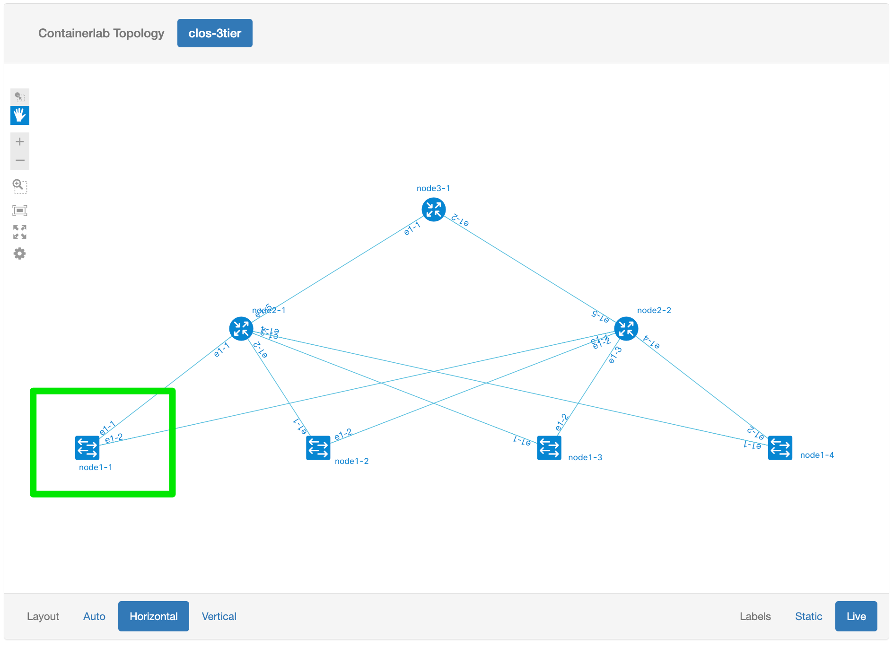

# Visualizing Containelab topologies

## Adding Graphite to a topology definition file


1. Create a topology definition file for ContainerLab. You could start with one of the examples [published](https://containerlab.srlinux.dev/lab-examples/lab-examples/) on ContainerLab website, or use your own topology. Here, we will use ContainerLab capability to generate Clos topologies.

    ```Shell
    cd $HOME/netreplica/clab
    CLAB_TOPO="clos-3tier"
    clab generate --name ${CLAB_TOPO} --nodes 4,2,1 > ${CLAB_TOPO}.yaml
    ```

    Alternatively, if you have an existing topology in a yaml file, you can skip this step and make a note of the caveats in the next step.

2. Now that you have a topology file, let's add `graphite` node to the file by adding the following lines under the `nodes:` section.  For a full topology example see [examples/2host.yaml](../examples/2host.yaml).

    ```Yaml
        graphite:
          kind: linux
          image: netreplica/graphite
          env:
            HOST_CONNECTION: ${SSH_CONNECTION}
          binds:
            - __clabDir__/topology-data.json:/htdocs/default/default.json:ro
            - __clabDir__/ansible-inventory.yml:/htdocs/lab/default/ansible-inventory.yml:ro
          ports:
            - 8080:80
          exec:
            - sh -c 'graphite_motd.sh 8080'
          labels:
            graph-hide: yes
    ```

3. Once added, deploy the topology. Note `-E` parameter for `sudo` – it is needed to pass `SSH_CONNECTION` variable.

    ```Shell
    sudo -E containerlab deploy -t ${CLAB_TOPO}.yaml
    ```

    Look for `Graphite visualization 🎨 http://<ip_address>:8080/graphite` Containerlab output. If you are running Containerlab on a VM via an SSH session, the `<ip_address>` in the URL should be the one you are using to connect to the VM, so there is a good chance the link will just work. If not, you might need to replace `<ip_address>` with proper address to connect to Graphite.

    

    Here is an example of what you could see (rendering is unique with every page refresh):

    

## Improve visualization via custom labels in a ContainerLab YAML file

The visualization we got on the previous step lacks hierarchy. Let's fix that by assigning nodes in the ContainerLab topology YAML file to different levels, using custom labels that Graphite understands.

1. Open the topology YAML file in the text editor and append the following lines to each `node1-*` definition.

    ```Yaml
          labels:
            graph-level: 3
    ```

    For example, `node1-1` definition should now look the following way:

    ```Yaml
    topology:
      nodes:
        node1-1:
          kind: srl
          group: tier-1
          type: ixrd2
          labels:
            graph-level: 3
    ```

2. Now assign `graph-level: 2` to every `node2-*` definition.

    ```Yaml
          labels:
            graph-level: 2
    ```

3. And, finally, assign `graph-level: 1` to every `node3-*` definition.

    ```Yaml
          labels:
            graph-level: 1
    ```

4. Redeploy the topology

    ```Shell
    sudo -E containerlab deploy -t ${CLAB_TOPO}.yaml --reconfigure
    ```

5. Now refresh the web page in the browser, and click "Vertical Layout". You should see a topology arranged in 3 Clos tiers. `node3-1` is on the top since it has `graph-level` value of 1.


## Changing visualization icons

All the nodes in our visualization so far represented by the same "router" icon. Let's assume that nodes at tier-1 in our Clos topology can act as L2 switches, and we want to reflect that in the visualization. To achieve that, we can use custom label again, with a name `graph-icon`.


1. Open the topology YAML file in the text editor and append the following line to each `node1-*` definition.

    ```Yaml
            graph-icon: switch
    ```

    For example, `node1-1` definition should now look the following way:

    ```Yaml
    topology:
      nodes:
        node1-1:
          kind: srl
          group: tier-1
          type: ixrd2
          labels:
            graph-level: 3
            graph-icon: switch
    ```

      Possible graph-icon types are (from [Cisco DevNet NeXT UI API doc](https://developer.cisco.com/site/neXt/document/api-reference-manual/files/src_js_graphic_svg_Icons.js/#l11)):

    | graph-icon | graph-icon | graph-icon |
    |---|---|---|
    |switch|router|wlc|
    |server|phone|nexus5000|
    |ipphone|host|camera|
    |accesspoint|cloud|unlinked|
    |firewall|hostgroup|wirelesshost|

4. Redeploy the topology

    ```Shell
    sudo -E containerlab deploy -t ${CLAB_TOPO}.yaml --reconfigure
    ```

3. Now refresh the web page in the browser, and click "Vertical Layout". Now the bottom row of nodes uses "switch" icons.

    

## Using `port` visualization mode

Some nodes that can be used within ContainerLab topology may not act as regular network devices. Examples of such nodes could be

  * Linux hosts with disabled IP forwarding,
  * Traffic Generators.

If such node has multiple interfaces connected to the emulated topology, its visualization might not represent their role well. To address this, there is a special `port` visuzalization mode available in Graphite. With such mode enabled for a node, each its interface would be displayed as a separate icon with a name "interface-name@node-name". Below is an example of using `port` mode for `ixia-c-one` traffic generator, together with a "cloud" icon:

```Yaml
    ixia:
      kind: keysight_ixia-c-one
      image: ghcr.io/open-traffic-generator/ixia-c-one:0.0.1-2770
      labels:
        graph-icon: cloud
        graph-mode: port
  links:
    - endpoints: ["pe-router:eth1","ce-router:eth1"]
    - endpoints: ["pe-router:eth2","ixia:eth1"]
    - endpoints: ["ce-router:eth2","ixia:eth2"]
```

The `ixia` node will be visualized as two icons `eth1@ixia` and `eth2@ixia`:


